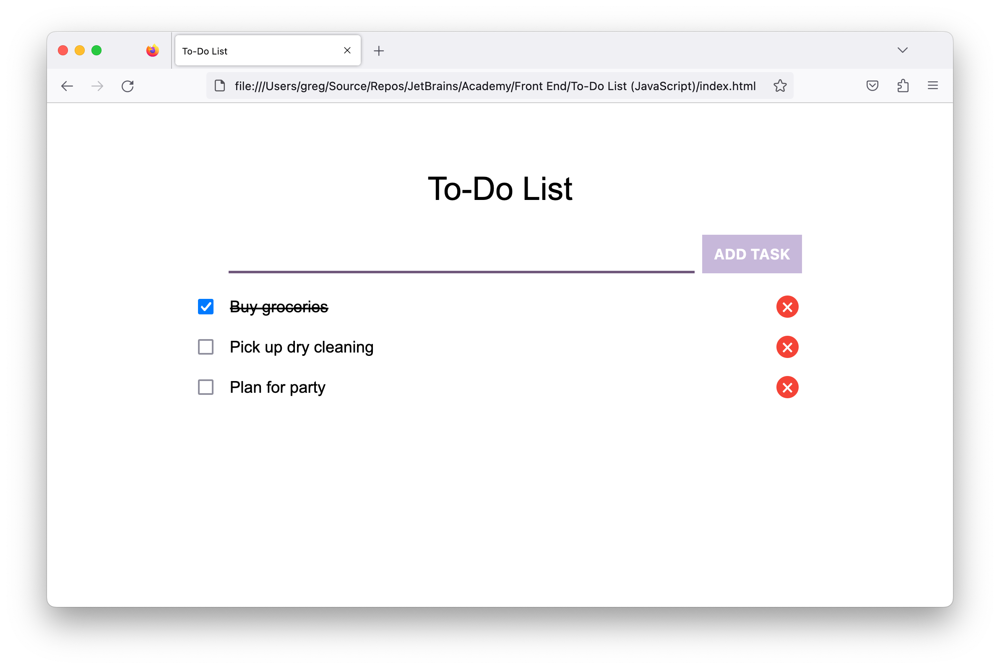
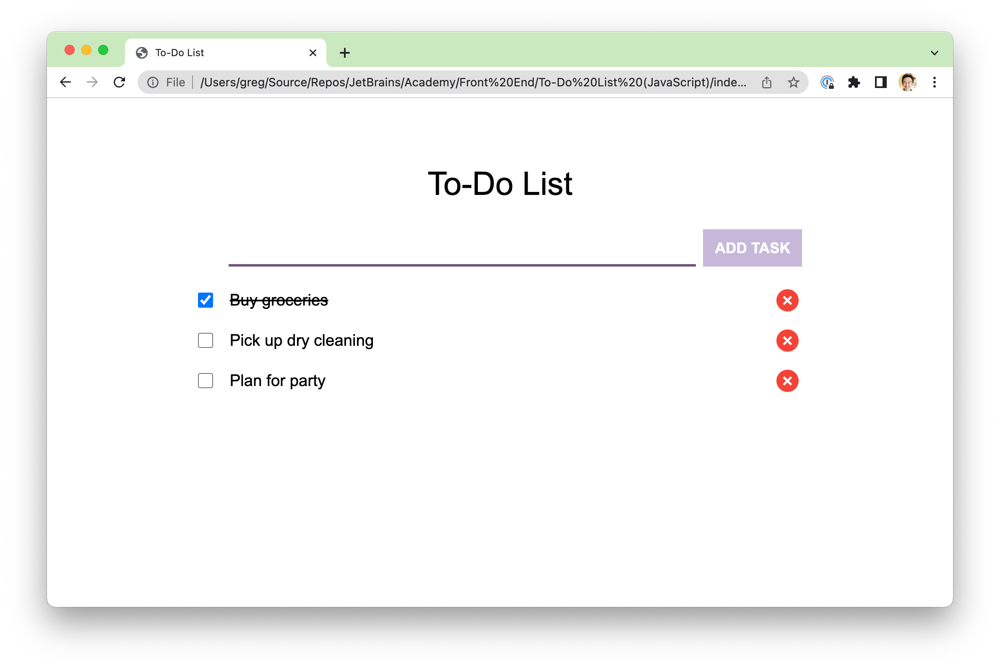

# JetBrains Academy To-Do List (JavaScript) Project

An example of a passing solution to the final phase of the JetBrains Academy Frontend Core To-Do List (JavaScript) project.

## Description

This project is a to-do list web application.
 

It includes styling adjustments to support a consistent appearance for multiple browsers.
 

The web page has semantic elements defining its structure. The web page stores the task list in local storage to persist the list between sessions.

Try the application out at [CodePen](https://codepen.io/kimnetics/pen/zYmBYbx).

## Notes

The relative directory structure was kept the same as the one used in my JetBrains Academy solution.

The project uses [Stylelint](https://stylelint.io/) for CSS linting with the [Recess* Property Order](https://github.com/stormwarning/stylelint-config-recess-order) plugin to ensure consistent ordering of the CSS properties. Most of the CSS standards are from [@mdo's Code Guide](https://codeguide.co/#css-syntax).

JavaScript is done in the [JavaScript Standard Style](https://standardjs.com/).
